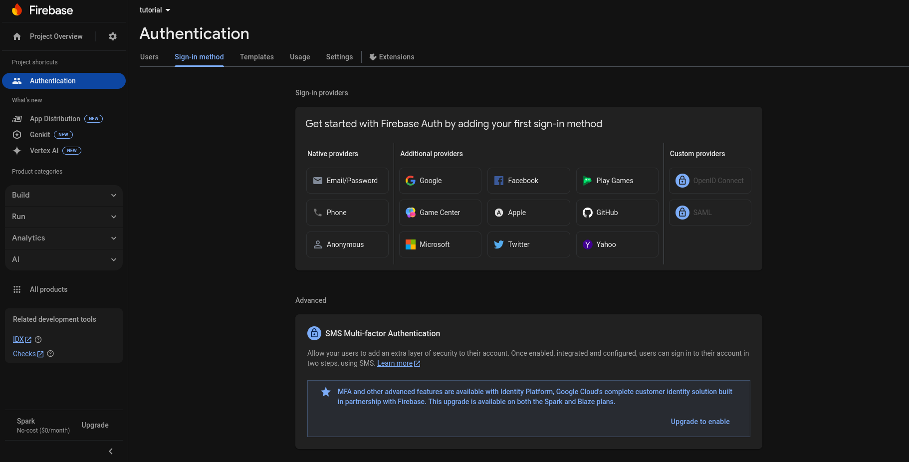

## 🧩 Firebase Setup

To get started, you'll need to create a Firebase project and enable the Firebase Authentication and Firebase Realtime Database modules.

### Creating the Firebase Project

1. Go to the Firebase Console: [Firebase Console](https://console.firebase.google.com).
2. Click the "Create Project" button and follow the prompts to fill in the necessary information.
    - You can disable Gemini and Google Analytics if you prefer.


After creating the project, you'll need to register the EmberIoT app within it to allow it to connect to your services.

3. In the project overview, click the button with the Android logo to start registering the app.
4. In the dialog that opens, enter the following Android package name: `com.emberiot.emberiot`.
    - This package name must match the one used in the Android app for proper connection.
5. Continue the setup process (you can skip the optional fields), then download the "google-service.json" file when prompted. Store it safely as you'll need it later.


### Setting Up Firebase Authentication

1. In the Firebase Console, go to the Authentication configuration page by clicking on the "Authentication" option in the left sidebar under the "Build" section.
2. Click the "Get Started" button to enable the authentication service.
3. Under the "Sign-in method" tab, enable the "Email/Password" sign-in method under "Native providers" (don’t enable the email link option unless you need it for something else).
4. Go to the "Settings" tab, find the "User Actions" section, and disable the "Enable create (sign-up)" option. This will ensure that only you can create new users.
5. Now, go to the "Users" tab and click the "Add User" button. Create a user with an email and password that will be used to sign in to the Android app and connect the microcontroller to the project. You can create as many users as you need.
6. Finally, go to the "Project Settings" page by clicking the gear icon in the top left corner. Take note of the "Web API Key" value as you will need it to connect your microcontroller to the Firebase project.





### Setting Up Firebase Realtime Database

1. In the Firebase Console, go to the Realtime Database page by clicking the "Realtime Database" button in the left sidebar under the "Build" section.
2. Click the "Create Database" button and choose the location closest to you. Start with "locked mode" to secure access.
3. Go to the "Rules" tab and paste the following rules to ensure that only authenticated users can read and write data to your database:


```json
{
  "rules": {
    ".read": "false",
    ".write": "false",

    "users": {
      "$uid": {
        ".read": "auth != null && auth.uid === $uid",
        ".write": "auth != null && auth.uid === $uid"
      }
    }
  }
}
```

4. Click the "Publish Rules" button to apply the changes.
5. Finally, note down the database URL in the "Data" tab, which will be required to connect your microcontroller to the Firebase Realtime Database.

---

With that, the Firebase setup is complete. Now you're ready to connect your microcontroller to the project.
